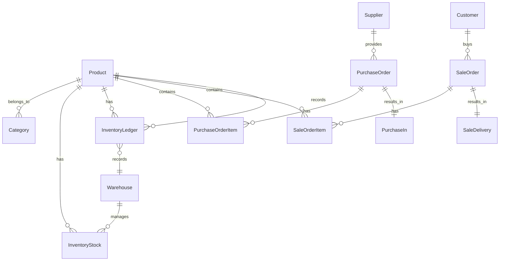

# 个体户进销存系统
> **定位**：面向个体户/小微商家的电脑端进销存工具，核心解决「货、钱、人」三大问题。  
> **技术栈**：Go 1.25+ / Gin + GORM v2 + GVA 脚手架 + Vue 3 (Element Plus / TypeScript) + MySQL 8.0  
> **目标**：4 周上线可用版本，先跑起来再迭代。

---

## 一、关键设计决策（编码前必须想清楚）

### 1.1 成本核算方法 — 就用移动加权平均

| 方法 | 复杂度 | 选择 | 说明 |
|------|--------|---------|------|
| **移动加权平均** | ⭐ 低 | ✅ | 每次入库重新算平均成本，实现简单 |
| 先进先出 (FIFO) | ⭐⭐⭐ 高 | ❌  | 需要批次管理，个体户用不上 |
| 个别计价 | ⭐⭐ 中 | ❌  | 仅适合大件商品 |

> **结论**：统一用**移动加权平均法**。

### 1.2 单据编号规则

```
格式：<前缀>-<日期>-<4位流水>
示例：PO-20260715-0001

前缀字典：
  PO = 采购订单    PI = 采购入库单    SO = 销售订单
  SD = 销售出库单  SQ = 报价单        CK = 盘点单
  CN = 收款单      PN = 付款单
```

- 流水号按**前缀+日期**分组，每日从 0001 开始
- 用 `SELECT ... FOR UPDATE` 行锁防止并发重复（看附录的代码）

---

## 二、核心数据模型

### 2.1 ER 关系



### 2.2 核心表清单（13 张）

| 表名 | 中文名 | 关键字段 | 备注 |
|------|--------|---------|------|
| `products` | 商品表 | `sku, barcode, category_id, cost_price, retail_price, warn_stock` | SKU+条码双索引 |
| `categories` | 商品分类 | `parent_id, name, level` | 树形结构 |
| `customers` | 往来单位 | `name, phone, type(client/supplier/both)` | 客户/供应商合一 |
| `warehouses` | 仓库 | `name, type(real/virtual)` | 默认 1 个 |
| `inventory_stocks` | 实时库存 | `product_id, warehouse_id, qty, cost_price` | 联合唯一索引 |
| `inventory_ledgers` | **库存流水** 🛡️ | `product_id, warehouse_id, change_type, qty_before, qty_change, qty_after, cost_before, cost_change, cost_after, ref_bill_no` | **只 INSERT，不 UPDATE/DELETE** |
| `purchase_orders` | 采购订单 | `bill_no, supplier_id, status, total_amount` | 状态机 |
| `purchase_order_items` | 采购订单明细 | `purchase_order_id, product_id, qty, unit_price` | |
| `purchase_ins` | 采购入库单 | `bill_no, purchase_order_id, status` | 支持分批入库 |
| `sale_orders` | 销售订单 | `bill_no, customer_id, status, total_amount` | 状态机 |
| `sale_order_items` | 销售订单明细 | `sale_order_id, product_id, qty, unit_price` | |
| `sale_deliveries` | 销售出库单 | `bill_no, sale_order_id, status` | 支持多次出库 |
| `receipts` | 收款单 | `bill_no, customer_id, amount, payment_method` | 核销应收 |
| `payments` | 付款单 | `bill_no, supplier_id, amount, payment_method` | 核销应付 |

### 2.3 库存流水表

```go
type InventoryLedger struct {
    ID          uint      `gorm:"primarykey"`
    CreatedAt   time.Time
    ProductID   uint      `gorm:"index;not null"`
    WarehouseID uint      `gorm:"index;not null"`
    ChangeType  string    `gorm:"size:30;not null;comment:purchase_in/sale_out/adjust/..."`
    RefBillNo   string    `gorm:"size:64;index;comment:关联单据号"`
    QtyBefore   float64   `comment:变动前数量`
    QtyChange   float64   `comment:变动数量（正=入库，负=出库）`
    QtyAfter    float64   `comment:变动后数量`
    CostBefore  float64   `comment:变动前成本`
    CostChange  float64   `comment:变动成本`
    CostAfter   float64   `comment:变动后成本`
    OperatorID  uint      `comment:操作人ID`
}
```

> 🔒 **铁律**：这表只有 INSERT，永不 UPDATE/DELETE。它是整个系统的数据基石。

---

## 三、阶段计划与预估时间

### Phase 1：基础搭建 + 商品数据（预估 6 天）

| 任务 | 内容 | 时间 |
|------|------|------|
| GVA 脚手架 + 权限 | 项目初始化、登录/账号/角色/权限、菜单管理、动态路由、前端 Layout | 2 天 |
| 基础数据 CRUD | 商品管理（分类+SKU+条码+单位+售价+成本）、往来单位（客户/供应商合并）、仓库管理 | 2 天 |
| 期初库存录入 | 系统首次启用时录入现有库存，生成 `opening` 类型流水作为起点，支持 Excel 导入和手动录入两种方式 | 1 天 |
| 基础设施代码 | 建好所有数据库表（含库存流水表）、单据号生成器、库存流水写入器 | 1 天 |

### Phase 2：采购 + 库存（预估 5 天）

| 任务 | 内容 | 时间 |
|------|------|------|
| 采购闭环 | 采购订单（创建→审核→关闭）、采购入库（支持分批）、自动加库存+写流水、自动生成应付暂估 | 2 天 |
| 库存核心 | 实时库存查询（按商品/按仓库）、库存流水追溯（只读）、盘点（盘点单→差异审核→自动调账）、库存预警 | 2 天 |
| 供应商对账 | 按单/按期间汇总应付款 | 1 天 |

### Phase 3：销售 + 看板（预估 7 天）

| 任务 | 内容 | 时间 |
|------|------|------|
| 销售闭环 | 报价单（可跳过）、销售订单（创建→审核→出库）、出库自动扣库存+写流水、自动生成应收账款、小票打印（选配） | 3 天 |
| 销售退货 | 客户退货→验货→入库→退款/冲账，库存回滚+流水记录，冲减原销售毛利 | 1 天 |
| 会员管理 | 会员资料（姓名+电话+等级）、会员价、消费记录查询、积分/储值（可选） | 1 天 |
| 每日看板 | 今日营业额/毛利、今日应收/已收、库存预警列表、快捷入口 | 2 天 |

### Phase 4：财务 + 部署上线（预估 7 天）

| 任务 | 内容 | 时间 |
|------|------|------|
| 资金管理 | 收款/付款核销、资金流水时间线、应收/应付账款表 | 2 天 |
| 利润报表 + Excel | 按商品/客户/时间段的毛利报表、Excel 导入商品/客户/初始库存 | 2 天 |
| 上线部署 | Docker Compose 部署、上线检查 | 3 天 |

```bash
# 开发环境
cd server && air
cd web && npm run dev
```

```yaml
# Docker Compose
version: '3.8'
services:
  mysql:
    image: mysql:8.0
    volumes:
      - mysql_data:/var/lib/mysql
    environment:
      - MYSQL_ROOT_PASSWORD=${DB_PASSWORD}
      - MYSQL_DATABASE=erp
    restart: always
  server:
    build: ./server
    ports:
      - "8080:8080"
    depends_on:
      - mysql
    environment:
      - GIN_MODE=release
    restart: always
  web:
    build: ./web
    ports:
      - "80:80"
    depends_on:
      - server
    restart: always
volumes:
  mysql_data:
```

#### 上线前必查清单

- [ ] Migration 脚本反复测过（含回滚）
- [ ] 核心 SQL 用 `EXPLAIN` 确认走索引
- [ ] 库存扣减事务压测过（50 并发无超卖）
- [ ] 单据号生成压测过（无重复）
- [ ] 前端 gzip + 强缓存
- [ ] Gin Recovery 中间件 + 统一错误处理
- [ ] 数据库每日自动备份
- [ ] 关键操作写审计日志

---

## 四、个体户特色功能

| 功能 | 说明 | 优先级 | 计划在第几周做 |
|------|------|--------|-------------|
| 扫码枪录入 | 扫条码自动添加商品，不用手打 | P0 | 第 1 周 |
| 拼音码搜索 | 输入"MT"搜"茅台" | P0 | 第 1 周 |
| 热敏小票打印 | 58mm/80mm 小票机，销售即打 | P1 | 第 3 周 |
| Excel 一键迁移 | 从 Excel 导入商品/客户/库存 | P1 | 第 4 周 |
| 每日自动备份 | 数据库自动备份到本地 | P1 | 第 4 周 |
| 快捷收银模式 | 纯键盘快速收款 | P2 | 上线后再做 |
| 价格标签打印 | 给商品贴价签 | P2 | 上线后再做 |
| 会员消费报表 | 按会员汇总消费金额和频次 | P2 | 上线后再做 |

---

## 五、GVA 脚手架适配说明

> GVA 默认的代码生成器面向通用后台 CRUD，进销存的核心是**跨表事务**，需要做以下适配。

### 需要修改的点

| 问题 | 原因 | 处理方式 |
|------|------|---------|
| 默认 Service 是单表 CRUD | 库存变动涉及 3 张表（库存+流水+单据） | 库存操作不调代码生成器的 Service，**手写事务 Service**，见附录 `7.2` 模板 |
| 代码生成器的 Create/Update 不能直接用 | 采购入库/销售出库需要写流水、扣库存、更新单据状态三步合一 | 生成器只生成基础字段，**事务逻辑手写覆盖** |
| gin.Context 传递 | GVA 部分中间件从 `c.Request.Context()` 取上下文路由信息 | 库存事务操作需从 controller 层传入 `context.Context`，保证超时控制和链路追踪 |
| GVA 的 `global.DB` | 全局 DB 实例，可直接使用 | 事务操作时用 `global.DB.WithContext(ctx).Transaction(...)`，不要直接用 `global.DB.Create` |

### 建议的项目结构

```
server/
├── api/           # Controller 层（GVA 生成）
├── service/       # 业务逻辑层
│   ├── base/      # 基础 CRUD（GVA 生成，不改）
│   └── business/  # 进销存事务服务（手写，包含事务）
│       ├── stock_engine.go    # 库存扣减/回滚引擎
│       ├── ledger_writer.go   # 流水写入器
│       └── bill_no_gen.go     # 单据号生成器
├── model/         # 数据模型
├── router/        # 路由
└── middleware/     # 中间件
```

---

## 六、非功能需求

| 维度 | 要求 |
|------|------|
| 并发 | 5~10 人同时操作，个体户足够用了 |
| 数据一致性 | 库存扣减必须事务 + 行锁，零超卖 |
| 可追溯 | 流水表永久保存，任何异常都能追查 |
| 备份 | 每日全量备份，保留 30 天 |
| 前端性能 | 商品列表超千行用 `el-table-v2` 虚拟滚动 |
| 响应时间 | 核心接口 < 200ms |
| 部署成本 | 单台 2C4G 服务器够用 |

---

## 七、附录：关键代码

### 7.1 单据号生成器

```go
type BillNoSequence struct {
    ID      uint   `gorm:"primarykey"`
    Prefix  string `gorm:"uniqueIndex:idx_prefix_date;size:10"`
    DateStr string `gorm:"uniqueIndex:idx_prefix_date;size:8"`
    Seq     uint   `gorm:"default:0"`
}

func (g *BillNoGenerator) Next(ctx context.Context, prefix string) (string, error) {
    dateStr := time.Now().Format("20060102")
    var seq BillNoSequence
    err := g.db.WithContext(ctx).Transaction(func(tx *gorm.DB) error {
        // 行锁：防并发重复
        err := tx.Clauses(clause.Locking{Strength: "UPDATE"}).
            Where("prefix = ? AND date_str = ?", prefix, dateStr).
            First(&seq).Error
        if errors.Is(err, gorm.ErrRecordNotFound) {
            seq = BillNoSequence{Prefix: prefix, DateStr: dateStr, Seq: 1}
            return tx.Create(&seq).Error
        }
        if err != nil {
            return err
        }
        seq.Seq++
        return tx.Model(&seq).Update("seq", seq.Seq).Error
    })
    if err != nil {
        return "", err
    }
    return fmt.Sprintf("%s-%s-%04d", prefix, dateStr, seq.Seq), nil
}
```

### 7.2 库存扣减（事务 + 行锁模板）

```go
func (s *StockService) Deduct(ctx context.Context, req DeductReq) error {
    return s.db.WithContext(ctx).Transaction(func(tx *gorm.DB) error {
        // 1. 行锁锁定库存行
        var stock InventoryStock
        if err := tx.Clauses(clause.Locking{Strength: "UPDATE"}).
            Where("product_id = ? AND warehouse_id = ?", req.ProductID, req.WarehouseID).
            First(&stock).Error; err != nil {
            return err
        }
        if stock.Qty < req.Qty {
            return ErrStockNotEnough
        }

        // 2. 扣减
        result := tx.Model(&stock).Update("qty", gorm.Expr("qty - ?", req.Qty))
        if result.Error != nil {
            return result.Error
        }

        // 3. 写流水（只 INSERT）
        tx.Create(&InventoryLedger{
            ProductID:   req.ProductID,
            WarehouseID: req.WarehouseID,
            ChangeType:  req.ChangeType,
            RefBillNo:   req.BillNo,
            QtyBefore:   stock.Qty,
            QtyChange:   -req.Qty,
            QtyAfter:    stock.Qty - req.Qty,
            OperatorID:  req.OperatorID,
        })

        return nil
    })
}
```

### 7.3 库存流水校验器（写入时调用）

```go
func validateLedger(entry *InventoryLedger) error {
    if entry.QtyAfter != entry.QtyBefore+entry.QtyChange {
        return fmt.Errorf("库存流水不平: after(%v) != before(%v) + change(%v)",
            entry.QtyAfter, entry.QtyBefore, entry.QtyChange)
    }
    return nil
}
``` 

